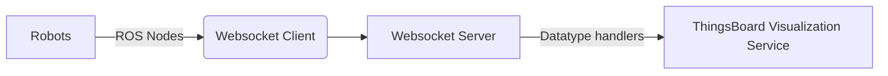

## Architecture Overview
This architecture consists of multiple components that work together to provide a complete solution for getting data from robots, processing the data, and visualizing it. The components of the architecture are:

- Robot with ROS
- Websocket Client
- Websocket Server
- ThingsBoard Server 

## Rover
The robot is equipped with ROS (Robot Operating System), an open-source, meta-operating system for robots. ROS provides a unified way to handle all the components of the robot, including sensors, actuators, and other hardware. The robot in this architecture is used to gather image data, state space data, and other relevant information.

## Websocket Client
The websocket client runs on the robot and serves as a bridge between the robot's ROS system and the websocket server. It receives data from the ROS system and sends it to the websocket server via websockets. This component is responsible for establishing the connection to the websocket server and sending the data received from the ROS system.

## Websocket Server
The websocket server serves as a centralized location for processing and managing incoming data from the websocket client. It receives data from the websocket client, processes it, and sends it ahead to the ThingsBoard visualization service.

The websocket server is written using the websockets library in Python. It provides a mechanism to handle different types of data coming in from the robot. The websocket server has a handlers submodule that contains all the handlers for different types of data, such as image data, state space data, etc. This submodule provides the ability to expand and handle more types of data in the future.

## ThingsBoard
ThingsBoard is an open-source IoT platform for data visualization and device management. It provides a dashboard for visualizing the data and a REST API for sending and retrieving data from the devices. In this architecture, the websocket server sends the processed data to the ThingsBoard visualization service, which displays it in real-time.

## Codebase Structure
The codebase for the architecture is organized into multiple modules and submodules. A flowchart describing the structure of the codebase is given below:

* Data Handlers
The data handlers are responsible for processing the data received from the websocket client. The data handlers are organized into a submodule called handlers. The handlers submodule contains all the handlers for different types of data, such as image data, state space data, etc. This submodule provides the ability to expand and handle more types of data in the future. 

* The websocket client module is responsible for sending data from the robot's ROS system to the websocket server. The websocket server module processes the incoming data and sends it to ThingsBoard. The handlers submodule contains all the handlers for different types of data and provides the ability to expand in the future.